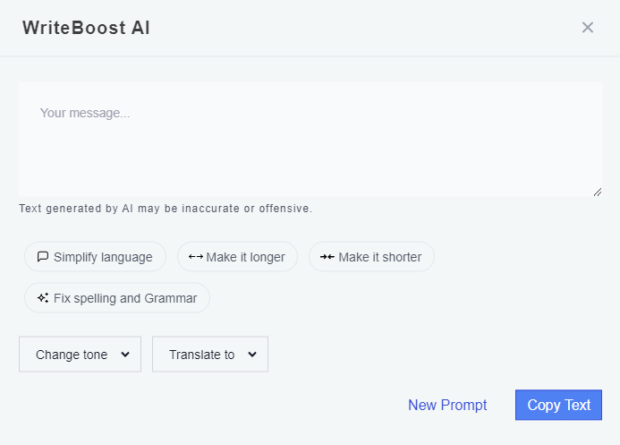

# WriteBoost AI

A Shopify App that allows Shopify Merchants to generate text directly within the Shopify Store Editor
(https://apps.shopify.com/ai-text-integrator)

## Features

- Create custom text through specfic instructions \(Ex. "Give me a new heading for the description about my pizza company"\)
- Simpify the language of the text in a single click
- Make the text longer or shorter in a single click
- Fix spelling and grammar errors in a single click
- Change the tone of the text
- Translate the text to another language

## Purpose

- Coming up with headers, descriptions, labels, and other text can be difficult when making a website
- WriteBoost AI allows you to do this and more all within the Shopify Store Editor
